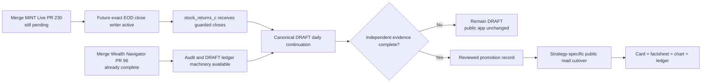
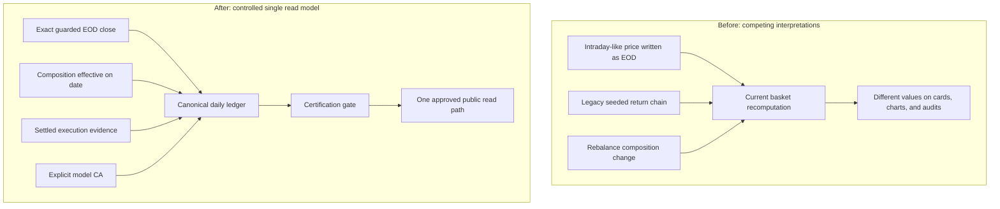
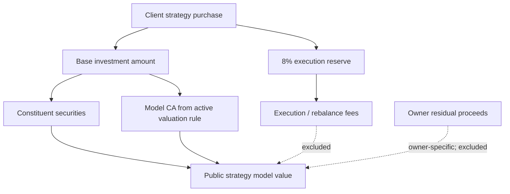
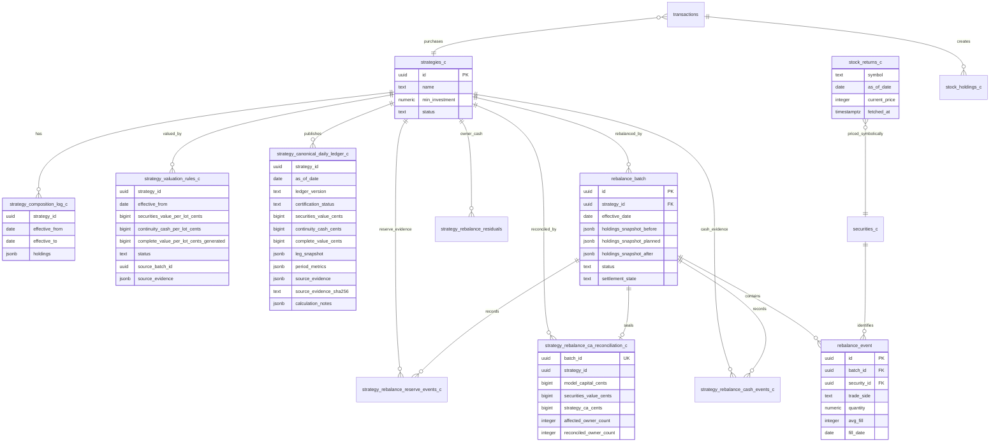
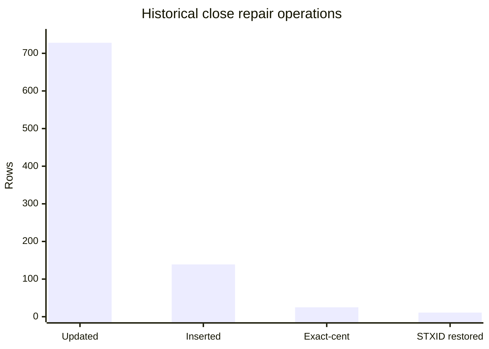
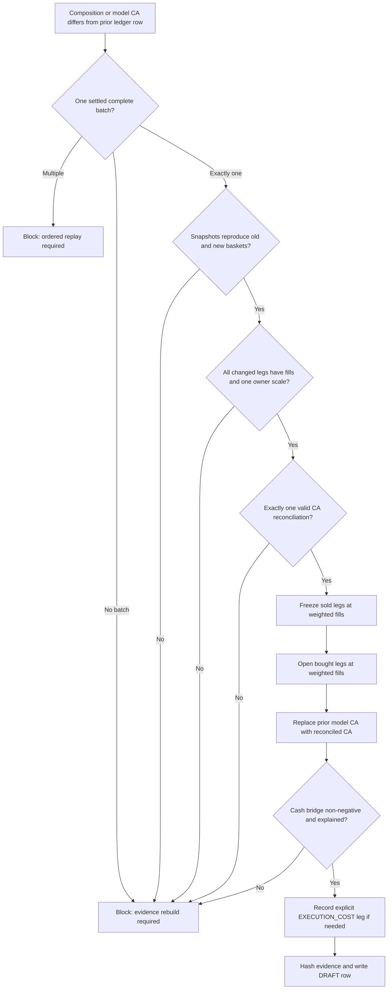
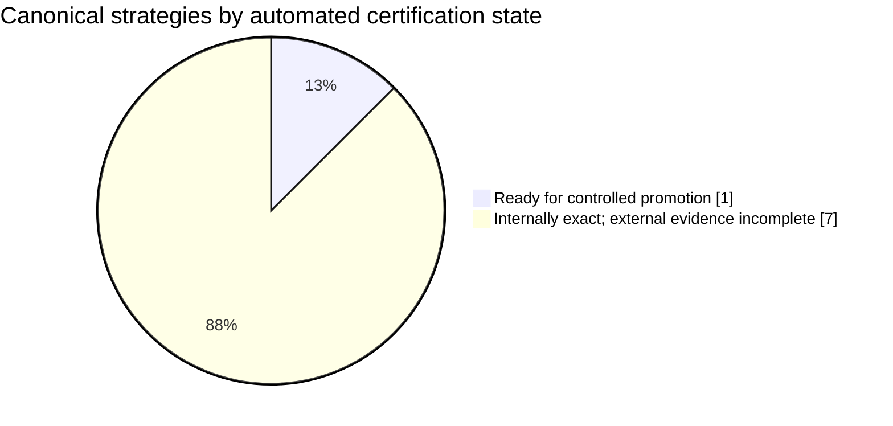
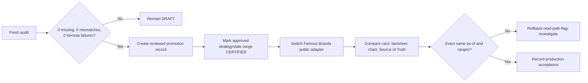

# MINT canonical returns and rebalance evidence programme

**Architecture, correction record, audit evidence, deployment behaviour, and controlled cutover runbook**

**As at:** 15 August 2026 (Africa/Johannesburg)

**Systems:** Wealth Navigator / OEMS, Retail Supabase, Institutional Supabase, MINT Live

**Primary objective:** make every public strategy value, chart, and return reproduce the supplied CEO workbook methodology without hiding a rebalance, inventing a close, or confusing strategy cash with a client's execution reserve.

---

## 1. Executive answer: what happens after merge?

There are two separate pull requests and they do different jobs.

| Repository / PR | Current status at 15 Aug 2026 | What the merge deploys | What it does **not** do |
| --- | --- | --- | --- |
| Wealth Navigator [PR #96](https://github.com/MINT-Developement/Wealth-Navigator/pull/96) | **Already merged**; Vercel passed | Canonical DRAFT ledger tooling, independent certification audit, Yahoo close repair and rollback tools, DRAFT replay, evidence-backed rebalance continuation, and the Source of Truth ledger UI | It does not promote DRAFT rows, replace public app values, or treat missing independent evidence as a pass |
| MINT Live [PR #230](https://github.com/MINT-Developement/MINT-LIVE/pull/230) | **Open draft**; `mint` and `mint-dev` Vercel checks passed | The recurrence fix: future EOD writes use an exact Yahoo daily market candle, normalize JSE units once, reject scale anomalies, and run later at 17:45 SAST | It does not rewrite all historical prices again, certify ledgers, or switch strategy cards/charts to the canonical table |

After PR #230 is merged, the safe operational state is:

1. future eligible daily closes are written using the corrected EOD contract;
2. suspect or missing provider data is skipped and reported instead of being manufactured;
3. the canonical daily writer can continue each strategy's **DRAFT** ledger after exact closes exist;
4. the Source of Truth page can inspect those DRAFT ledgers;
5. public MINT cards, factsheets, and charts stay on the existing effective read path until a strategy is explicitly certified and cut over.

The merge is therefore safe by design: **calculation and evidence infrastructure ships first; public publication remains a separate approval gate.**



---

## 2. Why this programme was necessary

The old system had several individually reasonable calculations that did not share one immutable strategy history. This created four classes of risk:

| Previous risk | Consequence | Correction |
| --- | --- | --- |
| The EOD worker copied the latest intraday observation | A stored "close" could differ from the official closing candle | Fetch the exact market-date daily candle and reject missing dates |
| Some pages calculated directly from current basket value | A rebalance could look like a gain/loss spike because the composition changed | Maintain a leg-based, continuity-preserving strategy ledger |
| Legacy return seeds predated some strategies' true inception | YTD/SI could include time when the strategy did not exist | Start each canonical history at the actual strategy creation/inception date |
| Cash, residual proceeds, and the 8% reserve were easy to conflate | Capital could appear from nowhere or be counted twice | Store and reconcile model CA, owner residual, and execution reserve separately |
| Yahoo/JSE units were assumed rather than proven | A 100x price defect could enter the database | Normalize ZAc/ZAR exactly once and quarantine implausible provider ratios |
| Supabase reads silently capped at 1,000 rows | Later prices could appear stale even when they existed | Paginate all historical close and ledger reads |
| Missing rebalance execution evidence was bridged implicitly | A composition jump could be mistaken for performance | Fail closed unless settled batch, fills, snapshots, and CA reconciliation agree |

### Before and after



---

## 3. Non-negotiable accounting identities

All monetary database values in this programme are stored in **integer cents** unless a legacy field explicitly says otherwise.

### 3.1 Strategy model value

```text
securities_value_cents
  = SUM(model units for each active holding × official close in cents)

complete_value_cents
  = securities_value_cents + continuity_cash_cents
```

`continuity_cash_cents` is the cash asset belonging to one model lot of the strategy. It is part of the strategy's investable composition and valuation.

### 3.2 Rebalance boundary identity

```text
model_capital_cents
  = securities_value_cents + strategy_ca_cents
```

The database constraint in `strategy_rebalance_ca_reconciliation_c` enforces this equality. It also requires:

```text
affected_owner_count = reconciled_owner_count
```

### 3.3 Three different cash concepts

| Concept | Table / field | Belongs to | Included in public strategy model value? | Purpose |
| --- | --- | --- | --- | --- |
| Strategy/model CA | `strategy_valuation_rules_c.continuity_cash_per_lot_cents` | The model strategy | **Yes** | Deliberate cash sleeve retained by the strategy |
| Owner residual cash | `strategy_rebalance_residuals.balance_cents` and immutable cash events | A specific investor/family member | No, not automatically | Unspent or realised cash attributable to that owner |
| 8% execution reserve | `transactions.buffer_cents` and reserve events | A specific purchase/owner | No | Fees and execution tolerance; must not be treated as strategy capital |

The 8% reserve is allocated at purchase and is used for execution costs. It is not the same thing as model CA and must never be added to the strategy's published NAV.



---

## 4. Canonical return methodology

The supplied workbook's `06_Strategy_Ledger` and `07_Public_Strategy_View` are the methodological reference. The canonical ledger models each security or cash movement as a dated leg rather than pretending the current basket existed unchanged from inception.

### 4.1 Per-leg P/L

For a leg that is still open on the report date:

```text
leg_current_value = units × report-date close
leg_benchmark_value = units × close on mapped benchmark date
leg_pnl = leg_current_value - leg_benchmark_value
```

For a leg sold after the benchmark date:

```text
leg_exit_value = units × actual exit/fill price
leg_benchmark_value = units × close on mapped benchmark date
leg_pnl = leg_exit_value - leg_benchmark_value
```

For a new leg opened after the requested benchmark:

```text
effective_benchmark_date = MAX(leg entry date, mapped period reference date)
```

The portfolio return for a range is:

```text
period_return_pct
  = SUM(all included leg P/L) / SUM(all included leg benchmark values) × 100
```

This prevents recycled capital from appearing as a gain and keeps realised sold-leg performance in the correct period.

### 4.2 Range/date mapping

Each daily ledger row contains the seven requested ranges derived from the same evidence:

| Range | Requested reference | Mapping rule |
| --- | --- | --- |
| 1D | previous calendar day | last canonical trading row on or before requested date |
| 1W | seven calendar days earlier | last canonical trading row on or before requested date |
| WTD | prior week end | last canonical trading row on or before the prior week-end reference |
| 1M | one calendar month earlier | same day where possible, then last canonical row on or before it |
| 3M | three calendar months earlier | same day where possible, then last canonical row on or before it |
| YTD | 31 December of prior year | last valid row on or before it; if the strategy began later, use inception |
| SI | actual strategy inception | first canonical strategy row |

This explains cases such as a Monday or public holiday: the as-of date can be the reporting date while the applicable comparison close is the most recent JSE session. A future close is never used.

---

## 5. System architecture

### 5.1 End-to-end data flow

```mermaid
flowchart LR
    subgraph Market[Market evidence]
      Y[Yahoo daily chart candle]
      I[IRESS / official JSE export]
      CAL[jse_trading_calendar]
    end

    subgraph MintLive[MINT Live]
      EOD[/api/prices/eod-save]
      GUARD[Unit + scale + exact-date guard]
    end

    subgraph Retail[Retail Supabase]
      SR[stock_returns_c]
      STR[strategies_c]
      COMP[strategy_composition_log_c]
      RULE[strategy_valuation_rules_c]
      RB[rebalance_batch]
      RE[rebalance_event]
      CASH[strategy_rebalance_cash_events_c]
      RSV[strategy_rebalance_reserve_events_c]
      REC[strategy_rebalance_ca_reconciliation_c]
      LED[strategy_canonical_daily_ledger_c]
    end

    subgraph WN[Wealth Navigator / OEMS]
      WRITER[Canonical DRAFT writer]
      AUDIT[Certification audit]
      SOT[Source of Truth / Ledger]
    end

    subgraph Public[Public consumers after promotion]
      CARD[Strategy cards]
      FACT[Strategy factsheet]
      CHART[Charts and range labels]
    end

    Y --> EOD --> GUARD --> SR
    I --> AUDIT
    CAL --> WRITER
    SR --> WRITER
    STR --> WRITER
    COMP --> WRITER
    RULE --> WRITER
    RB --> WRITER
    RE --> WRITER
    CASH --> REC
    RSV --> REC
    REC --> WRITER
    WRITER --> LED
    LED --> AUDIT
    AUDIT --> SOT
    LED -. only CERTIFIED / approved rows .-> CARD
    LED -. only CERTIFIED / approved rows .-> FACT
    LED -. only CERTIFIED / approved rows .-> CHART
```

### 5.2 Retail database ERD

This ERD shows logical relationships relevant to returns and rebalances. Some evidence relationships are enforced through application checks where a direct foreign key is not present.



### 5.3 Institutional-to-retail evidence chain

```text
Institutional Supabase
  rebalance_request_c
    -> rebalance_vote_c
    -> oems_order_audit
    -> oems_fill_settlement_c

Retail Supabase
  rebalance_batch
    -> rebalance_event
    -> strategy_rebalance_cash_events_c
    -> strategy_rebalance_reserve_events_c
    -> strategy_rebalance_ca_reconciliation_c
    -> strategy_canonical_daily_ledger_c
```

The request/order records explain intent and institutional execution. The retail settlement records prove the model/owner state actually changed. Both are useful, but institutional intent alone is not sufficient evidence to invent a retail settlement boundary.

---

## 6. Table catalogue and ownership

| Table/view | Environment | Role | Writer / owner | Public source now? |
| --- | --- | --- | --- | --- |
| `stock_returns_c` | Retail | Stored daily security closes | MINT EOD endpoint; historical repair tool only under explicit apply | Indirect input |
| `jse_trading_calendar` | Retail | JSE session/non-session truth | Annual market-calendar process | No |
| `strategies_c` | Retail | Strategy identity/current model metadata | Existing strategy management flow | Existing app dependency |
| `strategy_composition_log_c` | Retail | Effective-dated model holdings | Rebalance/model change flow | Calculation input |
| `strategy_valuation_rules_c` | Retail | Effective per-lot securities + model CA rule | Approved publication/reconciliation flow | Calculation input |
| `strategy_canonical_daily_ledger_c` | Retail | One row per strategy/session with values, legs, all ranges, and evidence | Canonical staging scripts and guarded DRAFT writer | **Not yet public; DRAFT shadow source** |
| `strategy_return_publication_audit_c` | Retail | Guarded legacy/effective publication evidence and boundaries | Existing return publisher | Existing chain input |
| `strategy_returns_effective_c` | Retail view | Current approved/effective strategy returns | Existing view chain | **Current public strategy return path** |
| `client_strategy_returns_effective_latest_c` | Retail view | Current approved owner-level values | Existing client return publisher/view | Current owner/AUM path |
| `rebalance_batch` | Retail | Settlement boundary and model snapshots | OEMS settlement | Evidence |
| `rebalance_event` | Retail | Immutable filled buy/sell legs | OEMS settlement | Evidence |
| `strategy_rebalance_cash_events_c` | Retail | Immutable owner cash movements | Atomic settlement | Evidence |
| `strategy_rebalance_reserve_events_c` | Retail | Fee reserve requested/consumed/shortfall | Atomic settlement | Evidence |
| `strategy_rebalance_ca_reconciliation_c` | Retail | Model capital identity and owner completeness | Reconciliation RPC / reviewed repair | Evidence and valuation rule input |
| `strategy_rebalance_residuals` | Retail | Current owner-specific residual balance | Purchase/rebalance settlement | Owner value, not model CA |
| `transactions` | Retail | Purchase plus separate model-cash allocation and 8% buffer | Purchase RPC | Purchase evidence |
| `rebalance_request_c` | Institutional | IC proposal, environment, composition | OEMS IC flow | Workflow only |
| `rebalance_vote_c` | Institutional | Immutable member vote | OEMS IC flow | Workflow only |
| `oems_order_audit` | Institutional | Orders/fills/audit | OEMS order book | Execution evidence |
| `oems_fill_settlement_c` | Institutional | Institutional settlement mirror | OEMS settlement | Execution evidence |

### Desired final state

The long-term public contract is **one canonical read model**, not many tables independently calculating performance. Evidence tables remain because they serve different accounting/audit purposes; they are not duplicate return tables. Once every strategy is certified and every consumer is migrated, obsolete return views/writers can be retired only after a dependency scan proves no active reader remains.

---

## 7. Price correction and recurrence prevention

### 7.1 Historical correction performed

Scope: 42 securities used by the eight active, non-test strategies, from 30 January 2026 through 14 August 2026.

| Pass | Result |
| --- | ---: |
| Existing stored closes corrected to exact Yahoo daily close | 728 |
| Missing official daily bars inserted | 139 |
| Total first-pass changes | **867** |
| Remaining exact-cent differences corrected on strict pass | 25 |
| STXID rows restored after provider-scale defect discovered | 11 |
| Final idempotency run | **0 changes** |

The correction modified the price input, then rebuilt the still-DRAFT canonical ledgers. It did **not** silently rewrite certified rows or the public return path.



### 7.2 Rollback evidence

Before each apply pass the tool generated a JSON backup in the operating-system temporary directory.

| Backup | SHA-256 |
| --- | --- |
| `mint-stock-returns-backup-1786810047891.json` | `0bf6f871127e3a02821fb3d79e46ec321f6b39351c613b5f82d77c5c35739822` |
| `mint-stock-returns-backup-1786811088806.json` | `4c21fbce895d286fd1ae5d45d0de30069a429b03d476dbbb25a43f0e2712ab1c` |

Provider evidence for the repair run was hashed as:

```text
02a5fe15862e66e2b73bd7e20b3a94560457db54ebcfc31d0b71a74b50edda01
```

The table above intentionally distinguishes the evidence hash from the backup-file hash; they prove different objects.

### 7.3 Unit and scale guard

The future writer applies these rules:

1. exact requested market date must exist in the Yahoo daily chart response;
2. `ZAc` is already cents and is not multiplied by 100;
3. `ZAR` is Rand and is multiplied by 100 once;
4. unsupported currency/unit is rejected;
5. compare candidate close to the latest guarded intraday reference;
6. reject the candidate if the price ratio is outside `0.2x` to `5x`;
7. never write a provider failure as zero or carry an arbitrary value.

STXID is the proof that this matters. Yahoo currently labels its series as ZAc while returning approximately `46.09`, versus stored/market evidence around `4,630` cents. Its median overlap ratio is `0.009980472987632893` across 14 observations, so it is quarantined rather than accepted as a 99% crash.

### 7.4 Daily writer sequence

```mermaid
sequenceDiagram
    participant Cron as Vercel cron 17:45 SAST
    participant API as MINT /api/prices/eod-save
    participant Yahoo as Yahoo daily chart
    participant Guard as Exact-date/unit/scale guard
    participant DB as stock_returns_c
    participant Ledger as Canonical DRAFT cron 19:30 SAST

    Cron->>API: run for JSE weekday
    API->>Yahoo: request daily candle per symbol/date
    Yahoo-->>API: timestamp, close, currency unit
    API->>Guard: normalize and validate
    alt valid exact candle
      Guard-->>DB: upsert exact cent close
    else missing / unsupported / scale divergent
      Guard-->>API: providerRejected + skip
    end
    Ledger->>DB: require exact same-day close for every active holding
    alt complete prices and unchanged model
      Ledger->>Ledger: append/replace DRAFT only
    else rebalance/model CA changed
      Ledger->>Ledger: require settled evidence boundary
    else evidence incomplete
      Ledger-->>Ledger: fail closed; retain last verified row
    end
```

---

## 8. Rebalance-safe continuation

A daily strategy row may cross a composition boundary only when the writer can prove exactly what happened.

### 8.1 Required evidence

| Required proof | Why |
| --- | --- |
| Exactly one non-reversed `SETTLED` / `COMPLETE` batch in the gap | Prevents collapsing multiple rebalances into one unexplained jump |
| Before and after/planned snapshots match old and new model baskets | Proves the batch belongs to this composition transition |
| Every changed ticker has a positive dated fill | Prevents using intent or proposed price as execution |
| Aggregate fills resolve to one consistent positive owner scale | Converts client-book execution totals back to a model-lot delta |
| Exactly one CA reconciliation | Establishes `model capital = securities + strategy CA` |
| Reconciled owner count equals affected owner count | Prevents partial settlement from becoming a public strategy boundary |
| Active valuation-rule CA equals reconciled strategy CA | Prevents a second, conflicting cash truth |

### 8.2 Boundary handling



### 8.3 Why this removes rebalance spikes

A raw current-basket chart changes its basis when old assets are sold and new assets are added. The canonical method preserves the sold leg's realised result, starts the new leg at its actual fill, and carries only genuinely undeployed model cash. Sale proceeds reused to buy another asset are capital recycling, not performance.

---

## 9. Current canonical ledger inventory

Fresh read-only certification audit run at `2026-08-15T17:22:51.009Z`:

| Strategy | Canonical rows | First date | Last date | Confirmed price mismatches | Missing independent price points | Formula failures | Automated certification |
| --- | ---: | --- | --- | ---: | ---: | ---: | --- |
| Blended Focus | 135 | 2026-01-30 | 2026-08-14 | 0 | 2 | 0 | Blocked by missing Aug-14 provider evidence |
| ETF Basket | 100 | 2026-03-20 | 2026-08-14 | 0 | 104 | 0 | Blocked by STXID quarantine + four Aug-14 provider gaps |
| MINT Diversified Basket | 135 | 2026-01-30 | 2026-08-14 | 0 | 2 | 0 | Blocked by missing provider evidence; boundary uses approved proxy classification pending sign-off |
| **MINT Famous Brands** | **135** | **2026-01-30** | **2026-08-14** | **0** | **0** | **0** | **PASS — ready for controlled promotion review** |
| MINT Multi-sector | 121 | 2026-02-19 | 2026-08-14 | 0 | 1 | 0 | Blocked by missing Aug-14 STX500 evidence; boundary proxy still needs sign-off |
| MyGrowthFund | 81 | 2026-04-20 | 2026-08-14 | 0 | 4 | 0 | Blocked by missing Aug-14 provider candles |
| UCT | 90 | 2026-04-07 | 2026-08-14 | 0 | 1 | 0 | Blocked by missing Aug-14 GLPROP provider candle |
| Yield Basket | 135 | 2026-01-30 | 2026-08-14 | 0 | 92 | 0 | Blocked by pre-29-Jun CLI independent history |

Total canonical rows: **932**.



The most important interpretation is:

- **zero mismatch** means every available independent provider point agrees;
- **missing** means the provider did not supply evidence and is not counted as a match;
- **zero formula failures** means the stored ledger reproduces its workbook formula evidence exactly;
- `certificationPass=false` is a deliberate safety state, not proof that the value is wrong.

Audit evidence hashes:

| Evidence | SHA-256 |
| --- | --- |
| CEO workbook methodology | `bde94581727f9a08232ec5e80f2672bde3a1ef73c733309ec8723fe78bcaa301` |
| Current independent provider audit payload | `c171b86d306fef657f00ed25f74c208c971c6fc6cecae4b6ace80913a6037c5e` |

---

## 10. Strategy-specific reconstruction notes

### MINT Famous Brands

- Static strategy family from actual inception.
- 135 JSE-session DRAFT rows.
- All available prices, valuation identities, workbook evidence, and formulas pass.
- First strategy eligible for a reviewed `DRAFT -> CERTIFIED` promotion.
- Promotion has **not** yet been performed.

### ETF Basket

- Begins on actual 20 March 2026 creation date, not the legacy 2023 return seed.
- Five-leg composition produces 100 canonical JSE-session rows.
- Stored STXID prices remain intact; Yahoo's current STXID series is quarantined for a roughly 100x scale divergence.
- Obtain a reviewed Satrix/JSE/IRESS official history before certification.

### Yield Basket

- Three completed evidence-backed boundaries were reconstructed; one reversed batch is excluded.
- Owner scales are 2, 3, and 3 model lots across the completed batches.
- Gross residual per model lot is 50,390 cents; authoritative model CA is 49,194 cents; the 1,196-cent difference is explicitly represented as an execution-cost bridge.
- CLI's older independent history is unavailable because the current provider series begins 29 June after the CLI leg ended. No price was invented.

### Blended Focus

- The 11 May boundary is reproduced using actual OUT sale and STX500 buy fills.
- The leg ledger prevents the rebalance from creating a false performance cliff.
- Current blocker is two unavailable provider points, not a confirmed mismatch.

### MyGrowthFund

- Full multi-boundary ledger uses the reviewed 23 July evidence repair plus two 3 August reconciled settlements.
- The 23 July repair records zero model CA because all surplus went to owner residual and fees came from execution reserve.
- Owner residual and reserve are explicitly excluded from public strategy CA.
- The currently missing four independent points are all 14 August provider gaps.

### MINT Diversified Basket and MINT Multi-sector

- Retail and institutional audits found no valid execution record for their June model changes.
- Their DRAFT histories use clearly labelled composition/model-EOD proxy boundaries, never disguised broker fills.
- They cannot be certified until the proxy is formally approved or replaced with real execution evidence.

### UCT

- Static inception-based reconstruction with 90 rows.
- Formula and all available provider comparisons pass.
- One missing 14 August GLPROP independent point blocks automatic certification.

---

## 11. Source of Truth Ledger UI

The Wealth Navigator Source of Truth page now exposes the physical canonical ledger as an audit surface:

- one strategy per workbook-like tab;
- daily complete-value line chart;
- securities, model CA, and complete-value identity;
- all seven period returns and mapped reference dates;
- per-leg evidence and entry/exit values;
- certification status and missing requirements;
- paginated history beyond Supabase's 1,000-row cap;
- Yahoo-style CSV upload for read-only independent price proof;
- normalized provider-evidence SHA-256.

The CSV proof endpoint is authenticated and read-only. It accepts `Date` + `Close`, optionally `Ticker`/`Symbol`, converts currency units to cents, applies a one-cent comparison tolerance, and reports matches, mismatches, or missing stored rows. It never promotes a strategy or rewrites a price.

---

## 12. Safeguards and failure behaviour

| Situation | Required behaviour |
| --- | --- |
| Requested date is not a JSE trading day | Exit with `not a JSE trading day`; no write |
| No prior canonical baseline | Skip with `NO_CANONICAL_BASELINE` |
| Existing row is not DRAFT | Refuse replacement |
| Missing exact daily close | Fail that strategy with `EXACT_CLOSE_MISSING:<ticker>` |
| Composition changed with no settled batch | `REBALANCE_REQUIRES_SETTLED_EVIDENCE_REBUILD` |
| Multiple boundaries in one gap | `MULTIPLE_REBALANCE_BOUNDARIES_REQUIRE_ORDERED_REBUILD` |
| Missing/duplicate CA reconciliation | `REBALANCE_CA_RECONCILIATION_REQUIRED` |
| Snapshot mismatch or inconsistent fill scale | Reject boundary |
| New CA exceeds explained prior cash/fill residual | Reject as unexplained external capital |
| Provider scale outside 0.2x-5x | Quarantine ticker; do not write |
| Provider returns no exact candle | Skip; do not copy intraday or zero |
| Certification evidence is missing | Keep DRAFT; do not call it a match |
| Test Strategy | Excluded from historical canonical family audit/public cutover |

### DRAFT replacement rule

Late-arriving official closes sometimes require a same-date replay. `replaceExistingDraft` allows an upsert only when the existing canonical row is still `DRAFT`. A `CERTIFIED` row is immutable to this routine and requires a separately reviewed correction process.

---

## 13. Implemented scripts and operator controls

| Script / endpoint | Mode | Purpose |
| --- | --- | --- |
| `scripts/audit-canonical-certification.mjs` | Read-only | Independent close, valuation, workbook-hash, formula, and certification report |
| `scripts/repair-stock-returns-yahoo.mjs` | Dry-run by default | Exact-date historical close audit/repair with scale quarantine and backup |
| `scripts/restore-stock-returns-backup.mjs` | Dry-run by default | Ticker-scoped restoration from repair backup |
| `scripts/audit-canonical-ledger-family.ts` | Read-only | Classify static vs evidence-dependent strategies |
| `scripts/audit-historical-certification-gaps.ts` | Read-only | Identify exact certification blockers |
| `scripts/stage-static-canonical-ledger.ts` | Dry-run by default | Build static inception-based DRAFT histories |
| `scripts/stage-single-boundary-canonical-ledger.ts` | Dry-run by default | Reconstruct one proven rebalance boundary |
| `scripts/stage-composition-proxy-canonical-ledger.ts` | Dry-run by default | Restricted, labelled proxy for unsupported Diversified/Multi-sector boundaries |
| `scripts/stage-etf-canonical-ledger.ts` | Dry-run by default | ETF-specific inception-safe reconstruction |
| `scripts/stage-yield-canonical-ledger.ts` | Dry-run by default | Yield multi-boundary execution-backed reconstruction |
| `scripts/stage-mygrowth-canonical-ledger.ts` | Dry-run by default | MyGrowth evidence-backed multi-boundary reconstruction |
| `scripts/run-canonical-ledger-draft.ts` | Dry-run unless apply env is set | Operate the shared daily DRAFT publisher |
| `/api/cron/canonical-ledger-draft` | Cron; dry unless explicitly enabled | Continue all eligible non-test DRAFT ledgers |
| `/api/admin/source-of-truth/price-proof` | Authenticated read-only | Compare uploaded provider evidence with stored exact closes |
| MINT `/api/prices/eod-save` | Production writer | Write future guarded exact Yahoo daily closes |

### Important environment controls

```text
APPLY_YAHOO_CLOSE_REPAIR=1
  Enables historical price repair. Without it, the tool is read-only.

REPAIR_DERIVED_STOCK_RETURNS=1
  Separate opt-in for uncertain legacy derived columns. It is not implied by close repair.

APPLY_CANONICAL_LEDGER_DRAFT=1
  Enables DRAFT ledger staging/writes for supported scripts.

REPLACE_EXISTING_CANONICAL_DRAFT=1
  Allows same-date DRAFT replay; never permits CERTIFIED replacement.

CANONICAL_LEDGER_DRAFT_APPLY=1
  Enables the scheduled daily canonical writer. Otherwise cron remains a dry-run/reporting path.
```

---

## 14. Testing and verification evidence

### Wealth Navigator

| Check | Result |
| --- | --- |
| Canonical focused regression tests | **18 passed** |
| TypeScript `tsc --noEmit` | **Passed** |
| Next.js 16.2.10 production build | **Passed** |
| 11-14 August DRAFT replay | 32 writes; 0 skipped; 0 failed |
| Post-repair idempotency | 0 price changes |
| Latest independent certification | 0 confirmed price mismatches; 0 valuation mismatches; 0 formula failures |
| Vercel PR deployment | **Passed** |

Focused suites covered the DRAFT writer, settled-boundary reconstruction, and Source of Truth audit surface.

### MINT Live

| Check | Result |
| --- | --- |
| Exact-close / unit / scale tests | **3 passed** |
| ZAc and ZAR normalization | Covered |
| Missing exact candle rejection | Covered |
| STXID-like 100x anomaly rejection | Covered |
| Vite 7.3.3 production build | **Passed** |
| Vercel `mint` check | **Passed** |
| Vercel `mint-dev` check | **Passed** |

---

## 15. Deployment and cutover plan

### Phase A — merge infrastructure

- [x] Merge Wealth Navigator PR #96.
- [ ] Review and merge MINT Live PR #230.
- [ ] Confirm production cron uses the new 17:45 SAST EOD route.
- [ ] Inspect the first production run for `providerRejected`, missing candle, or scale-quarantine results.

### Phase B — promote one proven strategy

Start with MINT Famous Brands only.



Promotion must be auditable and strategy-specific. Do not bulk-update all DRAFT rows merely because one strategy passes.

### Phase C — public read migration

For each promoted strategy:

1. card return and date read the latest approved canonical row;
2. factsheet ranges read that same row's `period_metrics`;
3. chart reads the same canonical daily history;
4. all surfaces show the same as-of date;
5. missing certified data fails closed or uses an explicitly labelled existing fallback—never a blended calculation;
6. compare values and chart shape in `mint-dev` before live deployment.

### Phase D — resolve the other seven

| Blocker | Resolution |
| --- | --- |
| STXID Yahoo scale defect | Obtain official Satrix/JSE/IRESS daily history and ingest it as reviewed independent evidence |
| CLI pre-29-Jun provider gap | Obtain delisted-security close history from an approved source |
| 14-August missing Yahoo candles | Retry provider or use reviewed official IRESS/JSE export for those exact dates |
| Diversified/Multi-sector unsupported June executions | Obtain broker/execution evidence or formally approve and document the proxy methodology |

### Phase E — consolidation and cleanup

Only after every public consumer has moved:

1. inventory all reads of raw/legacy strategy return tables and views;
2. prove no app, OEMS, cron, export, or admin page depends on each candidate;
3. retire competing writers first;
4. preserve immutable execution, cash, reserve, and audit evidence tables;
5. remove redundant return projections in a separately reviewed migration;
6. retain rollback/export evidence according to financial-record policy.

---

## 16. Rollback strategy

### If PR #230 causes an EOD issue

Do not compensate by writing guessed prices. Disable or revert the new writer deployment, leave the affected date absent, and investigate the provider response. An absent close is safer than a false close.

### If a historical close repair is questioned

1. run the restore tool in dry-run mode with the exact backup;
2. restrict restoration to the questioned ticker/date range;
3. review insert/delete/update counts;
4. apply only after approval;
5. replay only affected DRAFT ledger dates chronologically;
6. rerun the independent certification audit.

### If a public canonical cutover disagrees

Use a read-path feature flag or adapter rollback to restore the prior effective view. Do not delete the canonical evidence. Compare the exact strategy/date/period and record the discrepancy before any data mutation.

---

## 17. AUM relationship

AUM is an owner-level aggregation, not the model strategy NAV itself.

```text
retail AUM
  = SUM(latest approved owner basket value)
  across real, non-test owners
```

The appropriate current input is `client_strategy_returns_effective_latest_c`, with test profiles/wallets excluded. Public strategy canonical returns establish the strategy model's performance; they do not replace owner quantities, residual balances, liabilities, or family-member ownership. When the canonical strategy read is promoted, AUM still requires its own owner-level reconciliation and must not be calculated by multiplying a public percentage by deposits.

---

## 18. Known limitations and explicit non-claims

- Seven strategies are not yet independently certifiable through the automated gate.
- Missing Yahoo evidence is not proof that a stored close is wrong.
- Yahoo is not accepted as evidence for an actual rebalance fill.
- Composition proxy boundaries are clearly labelled and are not broker executions.
- The canonical table is a DRAFT shadow read model today; public cards/charts are not yet cut over.
- The historical repair targeted securities used by the eight real strategy families, not every security ever present in the database.
- Test Strategy is intentionally excluded from public historical certification.
- A successful build proves software integration, not financial approval.
- A merge is not a certification event.

---

## 19. Developer runbook

### Read-only family certification

```powershell
npm.cmd run audit:canonical-certification
```

Expected safe result before promotion:

- no provider errors;
- no provider scale quarantines for holdings in the strategy being promoted;
- zero price mismatches;
- zero missing provider points;
- zero valuation mismatches;
- zero formula failures;
- workbook SHA equals the approved workbook hash;
- `certificationPass: true` for that strategy.

### Historical repair discipline

```powershell
npm.cmd run repair:stock-returns-yahoo
```

This is dry-run by default. Review the output and backup location before enabling `APPLY_YAHOO_CLOSE_REPAIR=1`. After an apply, rerun without the flag and require zero changes.

### Acceptance checks after any ledger change

```powershell
npm.cmd run typecheck
npm.cmd run build
```

Run the focused canonical and rebalance suites as well. Record the exact counts, commit SHA, provider evidence hash, and workbook hash in the handover.

---

## 20. Commit and PR evidence

### Wealth Navigator

- Branch: `feat/Porting`
- Head implemented commit: `7b88276d9c9b21fee0dc956cb1ddf49fd1824500`
- PR: [#96 — Certify canonical closes and replay draft ledgers](https://github.com/MINT-Developement/Wealth-Navigator/pull/96)
- Current status: merged; Vercel success.

Key continuation commits include:

| Commit | Purpose |
| --- | --- |
| `214e2b9` | Add fail-closed canonical ledger writer |
| `0053248` | Continue canonical ledgers across verified rebalances |
| `7b88276` | Certify exact closes, replay DRAFT ledgers, add audit/repair/rollback tooling |

### MINT Live

- Branch: `port/gift-email-banners`
- Head commit: `cf612db8e58b12aab1e654c86e80ba3c6021acd2`
- PR: [#230 — Write verified official JSE closing prices](https://github.com/MINT-Developement/MINT-LIVE/pull/230)
- Current status: open draft; `mint` and `mint-dev` Vercel checks pass.

---

## 21. Final definition of done

This programme is complete only when all of the following are true:

- [x] Exact-close recurrence fix implemented and tested.
- [x] Historical target universe repaired with backup and idempotency proof.
- [x] All eight non-test canonical DRAFT histories constructed through 14 Aug 2026.
- [x] All seven return ranges derive from one daily ledger method.
- [x] Rebalance boundaries preserve leg P/L and explicit model cash.
- [x] Current audit has zero confirmed price, valuation, and formula mismatches.
- [x] Source of Truth Ledger audit surface exists.
- [ ] MINT Live PR #230 merged and first production EOD run observed.
- [ ] Controlled promotion mechanism reviewed and recorded.
- [ ] MINT Famous Brands promoted and verified end-to-end first.
- [ ] App card, strategy detail, factsheet, and chart all read the same certified rows.
- [ ] Remaining seven independent evidence gaps resolved or formally approved.
- [ ] All eight strategies certified strategy-by-strategy.
- [ ] Owner-level AUM reconciled after public cutover.
- [ ] Competing legacy return writers/read paths retired after dependency proof.

### Present conclusion

The calculation engine, evidence model, price repair, safe DRAFT replay, and audit tooling are built and verified. The system is **not yet at final public cutover**. The correct next move is to merge PR #230, observe the next guarded EOD run, then promote and cut over **MINT Famous Brands only** as the first end-to-end production proof.

---

## 22. Glossary

| Term | Meaning |
| --- | --- |
| CA | Cash allocation / cash asset retained within the strategy model |
| Canonical ledger | One effective-dated strategy history used to derive value and every return range |
| DRAFT | Calculated shadow row; not approved for public display |
| CERTIFIED | Reviewed row eligible for the approved public read path |
| EOD close | Official market-date daily closing candle, not simply the latest intraday tick |
| Leg | A dated holding/cash/execution-cost component with entry and optional exit evidence |
| Owner residual | Cash attributed to a particular client/family member after execution |
| Execution reserve | The separate 8% owner reserve used for fees/tolerance |
| Boundary | A date where the model composition or model CA changes |
| Evidence hash | SHA-256 fingerprint of normalized inputs used to make tampering/drift detectable |
| Fail closed | Skip or block publication when evidence is incomplete instead of guessing |
# Family-wide rollout update — 2026-08-15

The production design is no longer a Famous Brands-only overlay. Famous Brands was the first zero-gap proof strategy; the release path now covers every active, non-test strategy.

## Complete read path

`MINT /api/returns/approved` unions certified rows from `strategy_canonical_daily_ledger_c` with the legacy effective view. A certified canonical date may therefore add a missing newer date rather than requiring an existing legacy row. The API exposes `1D`, `1W`, `WTD`, `1M`, `3M`, `YTD`, and `SI`; `5d_pct` remains a compatibility alias for `1W`. Personal client returns remain sourced from `client_strategy_returns_effective_c` because owner cash flows must not be replaced by model-strategy performance.

## New-strategy lifecycle

On the first eligible JSE close after a new active strategy has an active composition and valuation rule, the daily writer creates a DRAFT inception ledger row automatically. It requires an exact same-date stored close for every security and includes continuity cash from the active valuation rule. Every inception range starts at zero. The row remains non-public until certification; this prevents a newly curated strategy from publishing unreviewed values while removing the former manual baseline dependency.

## Controlled family promotion

`scripts/promote-canonical-ledger-family.mjs` validates every DRAFT row for the complete-value formula, a non-empty leg snapshot, and all seven finite period returns. Dry-run is the default. Apply mode requires an explicit certifier UUID, a detailed reason, and `CANONICAL_EVIDENCE_WAIVER=1`. The decision is embedded in `source_evidence`, including known independent-provider gaps, and Test Strategy is always excluded. The MINT certified-union read path must be deployed before apply mode is used.

Promotion changes the displayed return values and chart series because the app then reads the canonical complete-value chain. It does not rewrite owner-level personal returns.

## Pre-merge workbook review

The Wealth Navigator branch preview exposes `Admin → Source of Truth → Ledger` while every canonical row is still DRAFT and invisible to the retail app. `Export Excel` downloads one worksheet per active strategy. Each dated row contains securities, continuity CA, formula-driven complete value, certification status, and the reference date, opening value, P/L, and formula-driven return for 1D, 1W, WTD, 1M, 3M, YTD, and SI. Excel recalculation is enabled so reviewers can inspect formulas and alter a copy without changing the database.
