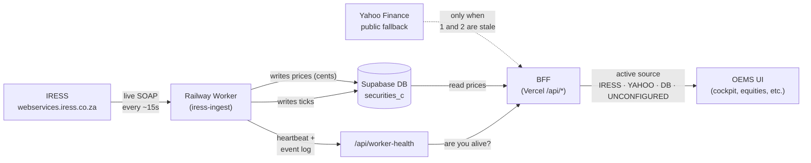
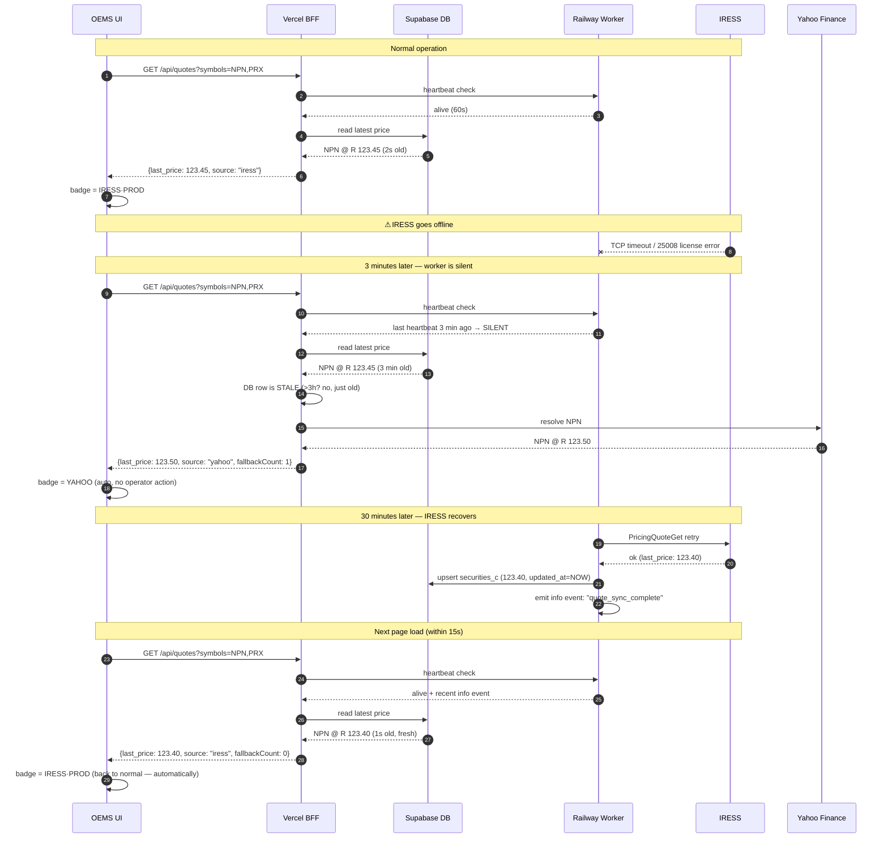

# Data Flow & Fallback — Plain-English Guide

> Audience: anyone — desk ops, support, finance, leadership. No code knowledge required. For implementation details, see the cross-references at the bottom.

## 30-second version

The platform shows **market data** (prices, indices, movers, etc.) on every screen.

There are **three sources** it can pull from, in this order of preference:

1. **IRESS** — our live market-data vendor (the gold standard, official exchange feed).
2. **The database** — what we cached from IRESS last time we heard from it.
3. **Yahoo Finance** — a public backup feed we use **only** when 1 and 2 are both stale.

The **"active source"** is whichever one is currently producing a usable price. When IRESS is up, prices come from IRESS. The instant IRESS goes quiet, the platform automatically falls back to the database, and if the database is stale, to Yahoo. When IRESS comes back, the platform automatically goes back to IRESS.

There is **no manual switch**. There is **no re-login, no data refresh, no operator action**. The active source flips on its own based on what's healthy.

## The data pipeline, end to end



In words: IRESS is the heartbeat of the platform. The Railway worker is our local agent that talks to IRESS and writes to the database. The BFF (the API layer on Vercel) reads from the database and renders prices on every page. When the database is stale, the BFF asks Yahoo. The UI surfaces which source is currently in use as a small badge in the header — see "How the UI tells you what's active" below.

## What "active source" means at any moment

| Active source | Means | What you see on the UI |
|---|---|---|
| **IRESS·PROD** | The Railway worker is heartbeating AND the most recent IRESS call succeeded. Prices flow: IRESS → worker → DB → UI. | Badge: `IRESS·PROD` |
| **HYBRID** | Same as IRESS·PROD, but for some symbols the DB row was stale and Yahoo filled it in. | Badge: `IRESS·PROD` with a small `+ yahoo` tag |
| **YAHOO** | IRESS is degraded (worker silent past 60s OR IRESS calls returning errors) and Yahoo is serving prices for stale DB rows. | Badge: `YAHOO` |
| **SUPABASE** | The DB is the live source (mock/UAT mode or worker silent but DB still fresh). | Badge: `SUPABASE` |
| **UNAVAILABLE** | Mock seed / unconfigured / fully offline — no live price exists. | Badge: `UNCONFIGURED` |

## The fallback decision tree

```mermaid
flowchart TD
  Start([BFF needs a price]) --> Q1{Is IRESS mode<br/>set to 'live'?}
  Q1 -- "No (mock / UAT)" --> Mock[Badge = MOCK / IRESS·UAT]
  Q1 -- "Yes" --> Q2{Is the Railway worker<br/>heartbeating?}
  Q2 -- "No (worker silent)" --> Q3{Has any symbol<br/>been served by Yahoo?}
  Q2 -- "Yes" --> Q4{Did the most recent<br/>IRESS call succeed?}
  Q4 -- "No (errors)" --> Q3
  Q4 -- "Yes" --> Live[Badge = IRESS·PROD<br/>(or HYBRID if Yahoo<br/>filled some rows)]
  Q3 -- "Yes" --> Yahoo[Badge = YAHOO]
  Q3 -- "No" --> Q5{Is the DB row fresh<br/>(less than 20s old)?}
  Q5 -- "Yes" --> DB[Badge = SUPABASE]
  Q5 -- "No" --> Yahoo2[Badge = YAHOO<br/>(the platform tells you<br/>Yahoo will resolve<br/>on the next call)]
```

In plain English: the platform asks three questions in order — *Is IRESS healthy? → Is the DB fresh? → Is Yahoo resolving?* — and shows whichever one is currently answering.

## What happens when IRESS goes down



The yellow boxes are the only operator-visible state changes. The platform silently reroutes around the outage; the operator sees the badge flip from `IRESS·PROD` → `YAHOO` → `IRESS·PROD` with no intervention.

## How the UI tells you what's active

Every page in the OEMS trading desk has a small badge in the top-right of the header. **Hover over it** to see the one-line reason. Example tooltips:

| Badge label | Hover tooltip |
|---|---|
| `IRESS·PROD` | `IRESS production seat is live — last quote sync 12s ago.` |
| `HYBRID` | `IRESS production seat is live; 3 symbols on the Yahoo fallback because the DB row was stale past IRESS_STALE_FALLBACK_HOURS.` |
| `YAHOO` | `IRESS worker is silent past the heartbeat window — Yahoo live fallback is serving prices for stale DB rows.` |
| `SUPABASE` | `IRESS worker is silent; the most recent Supabase tick is still inside the freshness window.` |

## What operators need to do — almost nothing

### When you see IRESS·PROD
Nothing. The system is healthy. The badge is informational.

### When you see YAHOO (or HYBRID with high `+ yahoo` count)
1. Open the **/oems/integration** page — it shows the Railway worker's heartbeat, IRESS service calls, and recent error events.
2. Check the worker: is it heartbeating? Are there 25008 (license seat) errors?
3. If the worker is down, the operator doesn't need to do anything on the data side — Yahoo is already serving the right prices. The system will auto-recover when IRESS comes back.
4. If the worker is up but IRESS calls are failing, that's an IRESS-side outage; the system handles it the same way.

### When you see UNCONFIGURED
Something is genuinely wrong with the deployment. Check:
- `IRESS_MODE` env var on Vercel
- `USE_SUPABASE_QUOTES` env var on Vercel
- Supabase credentials

## Why this is safe

A few guard rails the platform has built in so the fallback never produces wrong numbers:

### 1. Cents safety
- `securities_c.last_price` is stored as **integer cents** (e.g. R 123.45 → 12,345).
- Yahoo returns prices in their native currency. JSE `.JO` symbols are already in ZAc (cents). Non-JSE are major-currency units. The platform **never multiplies or divides** a Yahoo price — it has a single helper that detects `.JO` and stores verbatim, or detects non-JSE and stores ×100. No "100x bug" is possible.

### 2. IRESS-back-online recovery is automatic
There is **no state to reset, no cache to invalidate, no signal to broadcast**. The freshness check (`now - updated_at > IRESS_STALE_FALLBACK_HOURS`) inspects the database timestamp on every call. The instant the worker writes a fresh row:
- The DB freshness gate flips to "fresh".
- `resolveSecurityPrices` keeps the DB value (no Yahoo call).
- The cockpit's centralized helper sees the latest `info` event in the worker's log.
- The badge flips from `YAHOO` → `IRESS·PROD` on the next page load.

### 3. The in-process Yahoo cache is bounded
Yahoo responses are cached per-symbol for **60 seconds inside one warm Vercel instance**. This prevents hammering Yahoo during a burst of read requests. The cache is empty on cold-start, so a brand-new Vercel instance recovers instantly when IRESS comes back.

### 4. The fallback is never silent
Every page that displays a price knows which source served it. If a price came from Yahoo, the per-symbol badge shows `YAHOO`. If from IRESS, it shows `IRESS·PROD`. There's no ambiguity.

## Glossary for non-technical readers

| Term | What it means in plain English |
|---|---|
| **IRESS** | The market-data vendor (vendor = company we pay to get live prices). It's the official source. |
| **The Railway worker** | A small program running on Railway (our hosting) that talks to IRESS on our behalf and writes the prices into our database. It's the messenger. |
| **The database (Supabase)** | Where we store everything, including the most recent price for every stock. |
| **Yahoo Finance** | A free public stock-price website. We use it as a backup feed — never the primary, never a source of truth. |
| **BFF (Vercel API)** | The code that powers the UI. It reads from the database, asks Yahoo when needed, and decides which source to label each price with. |
| **Heartbeat** | A periodic "I'm alive" message the worker sends. If Vercel stops hearing heartbeats, the worker is presumed down. |
| **IRESS_STALE_FALLBACK_HOURS** | How long a database price is trusted before we say "this is too old, ask Yahoo instead". Default: 3 hours. |
| **Cents** | All prices are stored as integer cents (e.g. R 12.34 = 1234 cents). Display code divides by 100 to show Rands. Yahoo gives us ZAc for JSE — same scale, same units. |
| **Active source** | Which of {IRESS, DB, Yahoo, none} is currently providing the number on your screen. |

## Where the code lives (for engineers)

- **Fallback helper:** `src/lib/market-prices/fallback.ts` — `resolveSecurityPrices`, `applyYahooFallback`, `summariseResolvedPrices`.
- **Yahoo cents safety:** `src/lib/truth/yahoo-live.ts` — `yahooPriceToCents`, `fetchYahooTruthQuote`.
- **Active-source decision:** `src/lib/market-prices/active-source.ts` — `resolveActiveDataSource`, `isIressServiceHealthy`, `isWorkerAlive`, `deriveDbFresh`.
- **Surfaced via `/api/quotes` BFF:** `src/app/api/quotes/route.ts` — emits `liveCount`, `fallbackCount`, `yahooCount`, `dbCount`.
- **Wired into the cockpit header chip:** `src/app/oems/cockpit-client.tsx`.
- **Wired into the iress-migration header chip:** `src/app/oems/iress-migration/iress-migration-client.tsx`.
- **Worker emits heartbeat + events:** `workers/iress-ingest/src/events.ts`, `workers/iress-ingest/src/supabase.ts`, `workers/iress-ingest/src/retail-ingest.ts`.
