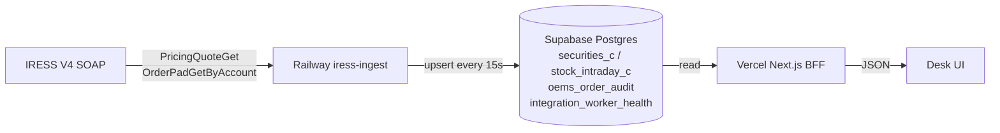
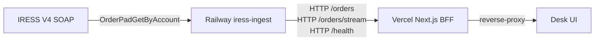

# Data Provenance — Mint Wealth Navigator OEMS

Living inventory of every data surface: what is **real IRESS**, what is **seed/mock**, and what is **hybrid**.

> Machine-readable source: `src/lib/iress/provenance.ts` · API: `GET /api/iress/provenance`  
> **Remaining gaps:** `docs/REMAINING_GAPS.md`

## Two paths: worker → Supabase → Vercel vs worker → Vercel (2026-06-12)

The Vercel BFF **never** holds the IRESS CT license seat — only the Railway `iress-ingest` worker does. Every page that wants IRESS data therefore falls into one of two paths, decided by whether the data needs DB persistence or can be served ephemerally:

### Path A — Worker → Supabase → Vercel (snapshots, audit, watchlist)



Use Path A when the data is needed **in many places**, must survive a Vercel cold start, or must round-trip a long-poll into a stable shape. All `GET` reads from Vercel hit Supabase — IRESS is only ever called from the worker.

| Route | What it reads | Why Path A |
|-------|---------------|-----------|
| `GET /api/quotes` | `stock_intraday_c` + `securities_c` | Many panels need the same row; SSE / Realtime fan-out from Supabase |
| `GET /api/orders` | `oems_order_audit` | Historical blotter; pages need filtered + paginated reads |
| `GET /api/worker-health` | `integration_worker_health` | Audit trail; survives worker restart, easy to diff over time |
| Supabase Realtime | `stock_intraday_c` INSERT | Sub-second tick fan-out to multiple Vercel instances |

Policy gate: `isUseSupabaseQuotesEnabled()` (server) / `isRealDataOnlyClient()` (browser) read `USE_SUPABASE_QUOTES` / `NEXT_PUBLIC_USE_SUPABASE_QUOTES`. When off, Path A degrades to the legacy `live-queries` SOAP path (still on the worker? no — that path hits IRESS directly via the in-process Vercel `IressClient`, which is for **local dev only**).

### Path B — Worker → Vercel (live orders, integration health, ephemeral)



Use Path B when the data is **live, per-request, and ephemeral** — no DB persistence needed, the worker is already a real-time source.

| BFF route | Worker endpoint | What it returns | Why Path B |
|-----------|-----------------|-----------------|-----------|
| `GET /api/orders/live?account=ACC1&filter=1` | `GET /orders` | `OrderPadGetByAccount` for the account, in near real-time | Working pad changes every second; persisting to `oems_order_audit` is the audit mirror, the live working state doesn't need a DB row |
| `GET /api/integration/health` | `GET /health` | In-process worker session + heartbeat (services cached, applicationId, accounts) | `integration_worker_health` is on a 30s heartbeat — too coarse for "is the worker up *right now*?" |
| `GET /api/orders/stream?account=ACC1` | `GET /orders/stream` | SSE: `snapshot` + `update` events every `interval` seconds (default 5) | SSE is the cheapest way to push the working pad to the blotter without a polling client |

Policy gate: `isWorkerLiveMode()` reads `USE_SUPABASE_QUOTES` (server-only). When on, Path B routes reverse-proxy via `IRESS_WORKER_URL` (or `RAILWAY_SERVICE_URL`); when off, Path B routes return 503 `worker_mode_off` and the UI falls back to the audit read.

### Why two paths instead of one?

| Concern | Path A wins | Path B wins |
|---------|-------------|-------------|
| License seat contention | Worker is sole SOAP caller | Same |
| Survives Vercel cold start | Yes — DB row pre-exists | No — every cold start is a fresh fetch |
| Multi-instance fan-out | Postgres + Realtime scale horizontally | BFF SSE holds one connection per browser |
| History / audit / RLS | Postgres is system of record | None — working pad is volatile |
| Network egress from Vercel | DB-only; no SOAP | SOAP via worker (worker egress only) |

### Auth and credentials

- IRESS creds (`IRESS_USERNAME`, `IRESS_PASSWORD`, `IRESS_COMPANY_NAME`) live **only on the worker**. Path B routes never see them — the worker owns the license seat.
- The worker's HTTP API can require a shared `WORKER_HTTP_TOKEN` (sent as `Authorization: Bearer …` or `X-Worker-Token`). Default is "no auth" because both endpoints are private (Vercel never exposes `IRESS_WORKER_URL` to the browser).
- The BFF does **not** expose IRESS creds or the worker token to client bundles — both are server-only env vars.

### Failure modes (Path B)

| Symptom | BFF response | UI behaviour |
|---------|--------------|--------------|
| `IRESS_WORKER_URL` unset on Vercel | 503 `not_configured` | "Railway worker not configured" empty state |
| Worker URL set but `USE_SUPABASE_QUOTES` off | 503 `worker_mode_off` | Degrade to Path A audit read |
| Worker unreachable / ECONNREFUSED | 503 `unreachable` | "Worker offline — using last-known audit" |
| Worker takes > 10 s | 504 `timeout` | Surface "slow worker — retry" |
| Worker 4xx/5xx (e.g. empty `IRESS_ACCOUNT_CODE`) | 503 `upstream_error` + upstream body | Display worker's `error.code` + `error.message` ("Order account code not configured") |
| SSE client disconnects | Upstream `fetch` aborted; worker loop exits | Browser auto-reconnects via SSE `retry: 5000` |

All failures return 503 (never 500) so the UI can render a useful empty state instead of a hard error.

### Environment variables (Path B)

| Var | Where | Required for | Default |
|-----|-------|--------------|---------|
| `IRESS_WORKER_URL` | Vercel (server) | BFF → worker proxy base URL (`https://...up.railway.app` or `http://iress-ingest.railway.internal:8765`) | unset → 503 `not_configured` |
| `RAILWAY_SERVICE_URL` | Vercel (server) | Fallback for `IRESS_WORKER_URL` (Railway auto-injects the service URL into sibling services) | unset |
| `WORKER_HTTP_TOKEN` | Vercel + worker | Shared bearer token; BFF sends `Authorization: Bearer …`, worker 401s if mismatch | unset → auth disabled (both must opt in) |
| `WORKER_HTTP_DISABLED=1` | Worker only | Disables the worker's HTTP API (e.g. for ops or single-replica maintenance) | unset → HTTP API on |
| `WORKER_HTTP_PORT` | Worker only | Port for the worker HTTP server (used by `IRESS_WORKER_URL` builder) | `8765` |
| `USE_SUPABASE_QUOTES=true` | Vercel (server) | Gates `isWorkerLiveMode()` so Path B routes actually proxy | unset → 503 `worker_mode_off` |
| `NEXT_PUBLIC_USE_SUPABASE_QUOTES` | Vercel (browser) | Hides Path B affordances in the UI when off (so we don't show "live" features that will 503) | unset |

Worker also reads (existing): `IRESS_MODE`, `IRESS_USERNAME`, `IRESS_PASSWORD`, `IRESS_COMPANY_NAME`, `IRESS_ACCOUNT_CODE`, `IRESS_WORKER_DRY_RUN`, `SUPABASE_ALLOW_WRITES`, `TEST_SUPABASE_URL` / `TEST_SUPABASE_SERVICE_ROLE_KEY`. None of those need to be on Vercel.

## Real-data policy (2026-06-12)

When `USE_SUPABASE_QUOTES=true` and `NEXT_PUBLIC_USE_SUPABASE_QUOTES=true` (Vercel production):

- **Never** render seed/mock prices — `NumberCell` shows `—` when no Supabase tick exists.
- `/api/ticks` SSE and client random walk are **disabled**; quotes come from `/api/quotes` + Realtime only.
- Missing symbols (e.g. BHG hollow CT row) return `source: "unavailable"`, not `seed-fallback`.
- Panels without a live feed show `EmptyDataState` with "Data feed not configured".
- Orders read from `oems_order_audit` via `GET /api/orders`; worker health from `GET /api/worker-health`.

Local dev without the flags still uses mock adapter + seed for UI building.

## Summary (v2.0 live E2E)

| Status | Count | Meaning |
|--------|------:|---------|
| **LIVE** | 2 | Server routes hitting real IRESS SOAP |
| **HYBRID** | 8 | Mix of live API + tick stream + seed fallback |
| **SEED** | 28 | Deterministic `seed.ts` / synthetic UI |
| **MOCK** | 3 | In-process `mock.ts` (orders, blotter mutations) |
| **PENDING** | 0 | No V4 verb known yet |

## Legend

| Status | Badge | Description |
|--------|-------|-------------|
| LIVE | green | Data from IRESS CT/prod SOAP |
| SUPABASE | info | Worker snapshot in `stock_intraday_c` (BFF or Realtime) |
| HYBRID | blue | Live where possible; seed/sim fallback |
| SEED | amber | Static seed or synthetic generation |
| MOCK | muted | In-process mock adapter |
| T5_PASSTHROUGH | info | T5 vendor content; worker reads on demand via Path B; nothing persisted until vendor contract. UI shows `UNCONFIGURED` empty state when the BFF returns `source: "unconfigured"` |
| PENDING | — | No V4 method identified |

---

## Chrome vs panel provenance

Global chrome and per-panel badges answer different questions:

| Surface | What it shows | Driven by |
|---------|---------------|-----------|
| **Ticker bar** (top strip) | `SUPABASE` / `STREAM` / `MOCK` / `STALE` | Tick feed kind from `useQuoteFeedKind()` — set when BFF seeds ticks (`supabase`), SSE `/api/ticks` pushes (`stream`), or seed sim only (`mock`). Stale when last tick &gt; 20 s. |
| **Cockpit masthead** | `DataSourceBadge` on the page header | `useLiveQuotes` → `deriveDataSource()` from `/api/quotes` (when `NEXT_PUBLIC_USE_SUPABASE_QUOTES=true`) or `/api/iress/quotes` (local live only). |
| **Panel title row** | `DataSourceBadge` per panel | Explicit `dataSource` prop — e.g. movers panel uses quote provenance; sector heatmap / open orders stay `seed`. |

Production (Vercel): `IRESS_MODE=mock`, `USE_SUPABASE_QUOTES=true`, `NEXT_PUBLIC_USE_SUPABASE_QUOTES=true`. The Railway worker writes snapshots; the UI polls `/api/quotes` every ~15 s and optionally subscribes to `stock_intraday_c` INSERT for sub-second updates. Display-only sparkline jitter does **not** write to the database and does not run for Supabase-protected symbols.

---

## Cockpit (`/oems`)

| Surface | Route/Component | Current source | Live via IRESS? | V4 method | Status |
|---------|-----------------|----------------|-----------------|-----------|--------|
| KPIs (AUM, P&L) | cockpit-client | seed → oemsStrategies | No | — | SEED |
| Sector heatmap | SectorHeatmap | seed → sectorHeatmap | Yes | PricingQuoteGet | SEED |
| ZAR govi curve | cockpit-client | seed → zarGoviCurve | Yes | TimeSeriesGet2 | SEED |
| Top movers | cockpit-client + NumberCell | `/api/quotes` (Supabase) or `/api/iress/quotes` (local live) + tick store | Worker / Yes | PricingQuoteGet | SUPABASE / HYBRID |
| ALSI intraday | cockpit-client | seed + synthetic | Yes | TimeSeriesGet2 | SEED |
| Open orders | cockpit-client | mock → liveOrders | Yes* | OrderPadGetByAccount | SEED |
| SENS feed | cockpit-client | seed → sensFeed | No | — | SEED |
| News flow | cockpit-client | seed → newsFeed | No | — | SEED |
| Macro pulse | cockpit-client | seed → macroIndicators | No | — | SEED |
| JIBAR / USDZAR KPIs | KpiTile + NumberCell | seed + tick stream | Yes | PricingQuoteGet | HYBRID |
| Curve PCA | cockpit-client | hardcoded | No | — | SEED |

\* Needs `IRESS_ACCOUNT_CODE` for live orders.

## Blotter (`/oems/blotter`)

| Surface | Route/Component | Current source | Live via IRESS? | V4 method | Status |
|---------|-----------------|----------------|-----------------|-----------|--------|
| Orders table | blotter/page | mock → liveOrders | Yes* | OrderPadGetByAccount | SEED |
| New order | new-order-dialog | mock client | Yes | OrderCreate3 | MOCK |
| Cancel/amend | blotter/page | mock client | Yes | OrderDelete/Amend2 | MOCK |

## Security (`/oems/security`)

| Surface | Route/Component | Current source | Live via IRESS? | V4 method | Status |
|---------|-----------------|----------------|-----------------|-----------|--------|
| Quote header | security/page | `/api/iress/quotes` + tick | Yes | PricingQuoteGet | HYBRID |
| Intraday chart | SecurityChart | tick stream | Yes | PricingQuoteGetUpdates | HYBRID |
| Depth L2 | DepthLadder | synthetic | No | — | SEED |
| Time & sales | TimeAndSales | synthetic | No | — | SEED |
| Fundamentals | security/page | hardcoded | No | — | SEED |
| Watchlist | security/page | seed + live quotes | Yes | PricingQuoteGet | HYBRID |

## Other OEMS pages

| Surface | Route | Current source | V4 method | Status |
|---------|-------|----------------|-----------|--------|
| Equities universe | /oems/equities | seed | PricingQuoteGet | SEED |
| Strategies + holdings | /oems/strategies | seed | — | SEED |
| Fixed income bonds | /oems/fixed-income | seed | PricingQuoteGet | SEED |
| Money market | /oems/money-market | seed | TimeSeriesGet2 | SEED |
| Curves | /oems/curves | seed | TimeSeriesGet2 | SEED |
| Macro | /oems/macro | seed | — | SEED |
| News + SENS | /oems/news | `/api/iress/news` (Path B, vendor=SENS) OR seed | NewsVendorGet | T5_PASSTHROUGH / SEED |
| Integration health | /oems/integration | seed + `/api/iress/health` | IRESSSessionStart | HYBRID |

## Infrastructure

| Surface | Route | Current source | V4 method | Status |
|---------|-------|----------------|-----------|--------|
| Tick stream SSE | /api/ticks | local sim / live updates | PricingQuoteGetUpdates | HYBRID |
| IRESS health | /api/iress/health | session-manager | IRESSSessionStart | LIVE |
| Live quotes API | /api/iress/quotes | live-queries | PricingQuoteGet | LIVE |
| Session status | /api/iress/session | session-manager | IRESSSessionStart | LIVE |
| BFF quotes (DB-first) | /api/quotes | `fetchQuotesSafe` w/ `USE_SUPABASE_QUOTES=true` reads `stock_intraday_c`; else proxies to `live-queries` | PricingQuoteGet (worker) | HYBRID |
| BFF live orders (Path B) | /api/orders/live | reverse-proxies worker `/orders` | OrderPadGetByAccount (worker) | LIVE |
| BFF integration health (Path B) | /api/integration/health | reverse-proxies worker `/health` | session-manager (worker) | LIVE |
| BFF orders SSE (Path B) | /api/orders/stream | reverse-proxies worker `/orders/stream` | OrderPadGetByAccount (worker) | LIVE |
| BFF news (Path B) | /api/iress/news | reverse-proxies worker `/debug/news-vendor-probe` | NewsVendorGet (worker) | T5_PASSTHROUGH |
| Worker read-only HTTP | worker `:8765/{health,orders,orders/stream,debug/news-vendor-probe}` | `workers/iress-ingest/src/http-api.ts` | (worker-internal) | LIVE |
| `isWorkerLiveMode()` helper | `@/lib/data-policy` | `USE_SUPABASE_QUOTES` server flag | — | — |
| `WorkerReadOnlyApi` helper | `@/lib/iress/worker-api` | `fetch` w/ 10s timeout + error envelope | — | — |

## Persona placeholders (all SEED)

| Persona | Route |
|---------|-------|
| Strategist | /strategist |
| Wealth manager | /wm |
| Admin | /admin |
| Business | /business |
| Funeral cover | /fc |

---

## IRESS CT connectivity notes

If SOAP to `https://webservices-ct.iress.co.za/v4` fails (network, auth, WSDL entitlement), the app:

1. Logs the exact error server-side
2. Falls back to `seed-fallback` in `/api/iress/quotes`
3. Shows **SEED** or **HYBRID** badges — never pretends data is live
4. Documents the error in this file (update after verification runs)

### T5 — News (vendor content)

**Source:** IRESS Pro `NewsVendorGet` (base IRIS session; no IOS+/IPS/FIX+ service session required). Confirmed by Charles Ntjana on 2026-06-25 — Market Data and News in IRESS V4 surface through this single verb, not a separate SENS feed.

**Persistence:** **none**. T5 vendor content is "seed until contracted" per the standing rule, so the worker reads on demand and the BFF reverses-proxies the response to the UI. The worker **does NOT** write to `news_item_c` today; once a vendor contract is in place the worker can ingest (e.g. 6-hourly poll) and the OEMS can switch its UI to `/api/news`. Until then, `IRESS_RETAIL_DRY_RUN` / `SUPABASE_ALLOW_WRITES` are not in the news path.

**Vendor parameter:** default `IRESS` (broker-sourced general market news — the vendor the `DFM@Mint` IRESS Pro entitlement is for); override with `SENS`, `Reuters`, `Bloomberg`, `Moneyweb`, `Dow Jones`, `Business Day`. Unknown vendor codes are passed through verbatim — the SOAP server is the source of truth for what `Vendor` accepts. The default was switched from `SENS` → `IRESS` on 2026-06-25 (default-vendor change in `client.ts` JSDoc + `http-api.ts` probe default + `/api/iress/news` BFF default).

**Wire shape** (Charles' example):
```xml
<Header>
  <SessionKey>…</SessionKey>
  <RequestID>…</RequestID>
  <WaitForResponse>true</WaitForResponse>
  <PagingBookmark></PagingBookmark>
  <PagingDirection>0</PagingDirection>
  <Updates>false</Updates>
  <Timeout>25</Timeout>
  <PageSize>1000</PageSize>
</Header>
<Parameters>
  <Vendor>SENS</Vendor>
  <!-- vendor-specific filters: Category, SecurityCode, From/To, MaxResults -->
</Parameters>
```

`IressHeader` covers every standard V4 field. The CT build may also expect `InputLocalizationType` / `OutputLocalizationType` integers — not surfaced on `IressHeader` (no override needed today) but flagged for follow-up if the probe 25010s with "missing localization".

**Worker probe:** `GET /debug/news-vendor-probe?vendor=IRESS&pageSize=50&timeout=25[&includeBody=1]`. Rate-limited to 1 call per `NEWS_PROBE_MIN_GAP_MS` (default 10s) so a misconfigured client can't burn the CT license seat. Returns the first page + the first 10 headlines + the raw fault when the call fails.

**BFF passthrough:** `GET /api/iress/news?vendor=IRESS&pageSize=50&timeout=25[&includeBody=1]`. Returns:
- `200 { source: "unconfigured", tier: "T5", error: { code: "T5_NOT_PERSISTED" } }` when `IRESS_MODE=mock` (Vercel never calls IRESS)
- `503 not_configured` when `IRESS_WORKER_URL` unset
- `503 worker_mode_off` when `USE_SUPABASE_QUOTES` off
- `200 { source: "live", tier: "T5", ... }` with the worker's probe envelope when everything is wired
- `503 upstream_error` (entitlement, rate-limited, unreachable) when the worker says no

**Entitlement / open questions** (probe resolves):
- Does `NewsVendorGet` return full story bodies on the `DFM@Mint` profile, or headlines only?
- Does `Vendor=SENS` return results, or do we need `Vendor=IRESS` (broker-sourced)?
- Do `NewsVendorGetUpdates` / `NewsVendorGet2` exist on CT? Charles' example only mentioned `NewsVendorGet`.

### Last verification (2026-06-11)

```
Login:       OK — mint-auth cookie set
Health:      FAIL — soap:Receiver - Error: Login failed. Unknown client/user/password combination.
Quotes NPN:  OK — source=seed-fallback last=4180.55 (live=0 fallback=1)
```

IRESS CT rejected `DFM@Mint` / `123` on `webservices-ct.iress.co.za`. The app gracefully
falls back to seed data and shows **SEED/HYBRID** badges — never pretends quotes are live.

### CT quote row shapes (2026-06-12)

IRESS CT `PricingQuoteGet` returns **two row shapes** for JSE watchlist names:

| Shape | Example | Price fields | Scaling |
|-------|---------|--------------|---------|
| Bare `Last` | NPN | `Last=610` (ZAR) | None |
| `*Price` cents | FSR, MTN, SBK, AGL, BHG | `LastPrice`, `OpenPrice`, `PreviousClosePrice` | ÷100 when integer cents detected |

**AGL (~R1,200):** CT returns internally consistent prices via `LastPrice`/`OpenPrice`/`TotalValue÷TotalVolume` VWAP (~R1,200). This is **not** seed reference (~R552) and is **not** forced to seed — the mapper reflects CT feed as-is. Confirm board / `QuotationBasisCode` with Charles if seed parity is expected.

**BHG (~R528):** CT can send a **hollow** row — `LastPrice=PreviousClosePrice=2445` with zero Open/High/Low/Bid/Ask/Volume (no OHLC cents cluster). Mapper skips the write (`last=0`) rather than persisting R2445. Confirm `Board` / `QuotationBasisCode` / symbol entitlement with Charles.
