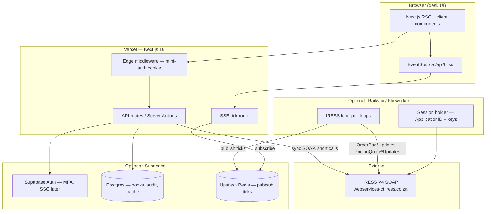
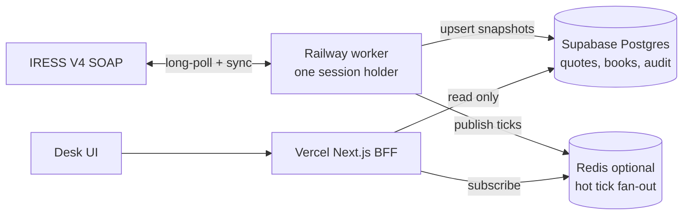

# MINT Wealth Navigator — Full-Stack Architecture Recommendation

> **Audience:** CTO / engineering leads building the OEMS desk now.  
> **Scope:** Institutional trading desk (OEMS centerpiece) with IRESS V4 integration; wealth-manager / funeral-cover personas deferred.  
> **Status:** March 2026 — aligned with `PLANNING.md`, `iress-v4-docs/`, and current `wealth-navigator/` codebase.

---

## 1. Executive summary

**Run the product on Vercel (Next.js 16 App Router) as the frontend + BFF, add Supabase Postgres + Auth when you move from the OEMS mock sprint to production banking, and defer Railway until IRESS long-poll or IP allowlisting forces it.** The codebase is already Vercel-shaped: edge middleware, Node API routes (`/api/auth/*`, `/api/ticks`), and a server-only IRESS SOAP adapter (`src/lib/iress/transport.ts`, `live.ts`) behind `IRESS_MODE=mock|live`. End-user login (`admin/admin`) is a dev stub; `DFM@Mint` / `123` are **IRESS Web Services credentials only** — they belong in server env vars (`IRESS_USERNAME`, `IRESS_PASSWORD`, `IRESS_COMPANY_NAME`), never in the browser or the login form in production. IRESS V4 long-polling can hold HTTP connections up to **1000 seconds** per update call; Vercel serverless caps at **60s (Hobby) / 300s (Pro)** — so sync calls and mock mode work on Vercel today; live blotter/order-pad streams likely need a **persistent worker** (Railway/Fly) once you go live.

---

## 2. Layer diagram



**Data flow (target production):** Browser → Vercel BFF (authenticated via Supabase JWT or session) → internal `/api/iress/*` proxies → IRESS SOAP. Live market/order updates: worker long-polls IRESS → Redis pub/sub → Vercel SSE/WebSocket fan-out to browsers. IRESS credentials never leave the server tier.

---

## 3. Component-by-component recommendation

| Layer | Recommendation | Rationale | Alternatives |
|-------|----------------|-----------|--------------|
| **Frontend + BFF** | **Vercel** (Next.js 16 App Router) | Already built; edge middleware (`src/middleware.ts`), preview deploys, SA latency acceptable for desk UI; `runtime = "nodejs"` on IRESS routes | Railway all-in-one, self-hosted K8s |
| **App auth** | **Supabase Auth** (or Clerk) | Real users, MFA, RLS-ready; replace `admin/admin` mock and cookie-only `mint-auth` | Auth0, custom JWT |
| **Database** | **Supabase Postgres** | Client book, order cache, audit trail, persona/WM data, RLS per desk | Neon, Railway Postgres |
| **Realtime ticks** | **Vercel SSE** (`/api/ticks`) + optional **Upstash Redis** pub/sub | Current SSE pattern works for mock; multi-instance Vercel needs Redis to fan-out worker ticks | Dedicated tick worker on Railway |
| **IRESS integration** | **Server-side only** on Vercel Node runtime; **Railway worker** for `*Updates` long-poll | SOAP + long-poll may exceed serverless timeouts (see §5); `transport.ts` already server-only | Railway persistent worker for all IRESS |
| **Secrets** | **Vercel env vars** (+ Supabase vault pattern later) | `IRESS_USERNAME`, `IRESS_PASSWORD`, `IRESS_COMPANY_NAME`, `IRESS_BASE_URL` — never `NEXT_PUBLIC_*` | Doppler, 1Password Secrets Automation |
| **CI/CD** | **GitHub Actions → Vercel** | Standard for Next.js; `bun run build` in CI | Railway auto-deploy |
| **Monitoring** | **Vercel Analytics + Sentry + IRESS health panel** (`/oems/integration`) | Desk already has integration surface; add synthetic `IRESSSessionStart` probe | Datadog, Better Stack |

### Current codebase anchors

| Concern | Where it lives today |
|---------|---------------------|
| IRESS adapter (mock/live) | `src/lib/iress/index.ts`, `mock.ts`, `live.ts`, `transport.ts` |
| Env contract | `.env.example` — `IRESS_MODE`, `IRESS_BASE_URL`, method filter lists |
| Dev auth stub | `src/app/api/auth/login/route.ts` — `admin/admin` + `DFM@Mint` flag |
| Route gating | `src/middleware.ts` — `mint-auth` HttpOnly cookie |
| Tick stream | `src/app/api/ticks/route.ts` — SSE, mock random walk |

---

## 4. What we need NOW vs LATER

### Now (MVP / IRESS integration sprint)

- [ ] **Vercel project** linked to repo; preview + production environments
- [ ] **Vercel env vars** (server-only):
  - `IRESS_MODE=mock` (default) → flip to `live` when Charles confirms sandbox
  - `IRESS_BASE_URL=https://webservices-ct.iress.co.za/v4`
  - `IRESS_USERNAME`, `IRESS_PASSWORD`, `IRESS_COMPANY_NAME` (from Charles — **not** end-user login)
  - `IRESS_APPLICATION_LABEL=Mint-OEMS-Production`
- [ ] Keep **mock mode** for UI dev offline (`IRESS_MODE=mock`)
- [ ] Wire **live adapter** behind server API routes only — remove `DFM@Mint` from login credential table before any external pilot
- [ ] **Optional (2–4 weeks):** Supabase project for auth stub — not blocking desk UI

### Later (production banking)

- [ ] **Supabase Auth** — MFA, SSO, per-desk user provisioning
- [ ] **Supabase RLS** — wealth-manager book isolation, audit read scopes
- [ ] **Audit log table** — order create/amend/delete, session events (compliance)
- [ ] **Railway or Fly.io IRESS session worker** if Vercel 60s/300s limits break `*Updates` long-poll
- [ ] **STRATE / settlement feeds** — likely non-IRESS; separate integration
- [ ] **Funeral cover** — separate system of record; do not fold into OEMS Postgres schema

---

## 5. IRESS-specific infrastructure needs

Sourced from `iress-v4-docs/` (transcription of the Programmer's Guide) and current adapter code.

| Requirement | Detail | Mint implication |
|-------------|--------|------------------|
| **HTTPS outbound** | All SOAP POSTs to `{baseUrl}/SOAP.aspx` | SA test: `https://webservices-ct.iress.co.za/v4`; prod: `https://webservices.iress.co.za/v4` |
| **TLS** | Standard HTTPS; no client certs documented in our docs set | Confirm with Charles if mutual TLS required |
| **IP allowlisting** | Not in our markdown docs; common for bank integrations | **Ask Charles.** Vercel = dynamic egress unless Enterprise static IPs; **Railway can provide stable egress** |
| **ApplicationID** | Required, unique per logical process; same `UserName + CompanyName + ApplicationID` recovers session | Pattern: `Mint-OEMS-<Env>-<Node>-<GUID>` — persist per worker node (`buildApplicationId` in `index.ts`) |
| **Session model** | `IRESSSessionStart` → optional `ServiceSessionStart` (IOS+/IPS/FIX+) | One IRESS session ≈ one user license; 50 concurrent requests per session |
| **Session lifetime** | 2h idle, 24h absolute, optional 01:00 server-time group expiry | Background re-login before idle timeout for 24/7 desk |
| **Long-poll** | `*Updates` methods hold connection up to **NoUpdateBlockTime = 1000s**; poll at least every ~25 min | **Conflicts with Vercel serverless max duration** — primary reason for Railway worker |
| **OrderTag** | UUID per `OrderCreate3` — idempotency | Implement in live trading path before prod |
| **gzip** | `Accept-Encoding: gzip` on every call | Add to `transport.ts` extra headers |
| **No creds in browser** | Username/password only in server env | Login form must authenticate **Mint users**, not IRESS WS |

### Serverless timeout mismatch (critical)

| Platform | Max function duration | IRESS long-poll |
|----------|----------------------|-----------------|
| Vercel Hobby | 60s | ❌ insufficient for live updates |
| Vercel Pro | 300s (configurable) | ⚠️ partial — IRESS may hold 1000s |
| Railway / Fly persistent process | unlimited | ✅ recommended for `*Updates` loops |

**Pragmatic split:** Vercel handles UI + short sync SOAP (session start, single `PricingQuoteGet`, `OrderCreate3`). Railway worker owns session state + long-poll loops, publishes to Redis → Vercel SSE.

---

## 5b. Production data flow — database first?

**Yes, for anything you need in many places.** With a **single concurrent IRESS license** and **serverless** Vercel instances, the website should **not** be the system that owns the IRESS session for market data.

### Recommended pattern



| Layer | Role | Why |
|-------|------|-----|
| **Ingestion worker** (Railway/Fly) | Holds **one** `IRESSSessionStart`, runs `*Get` / `*Updates`, normalizes rows | Avoids 25008 license fights; survives Vercel cold starts; supports 1000s long-poll |
| **Supabase Postgres** | **System of record** for quotes, instruments, positions, order audit, session metadata | Many pages/APIs read the same data; history, compliance, RLS per desk |
| **Redis (optional)** | Sub-second tick fan-out to many SSE clients | Postgres for truth; Redis for “last price” latency across Vercel instances |
| **Next.js BFF** | Auth, business rules, **reads DB** (and Redis for live tiles) | No IRESS password in browser; no per-request session start in prod |

### What goes where

| Data | Write path | Read path |
|------|------------|-----------|
| Live quotes / last | Worker → `market_quotes` (+ Redis) | UI, blotter, heatmap → `/api/quotes` → Postgres |
| Reference (instruments, curves) | Worker periodic `*Get` → tables | All OEMS pages |
| Orders / blotter | Worker or BFF on **user action** → `orders` + audit | Blotter, compliance |
| Health / admin | Worker heartbeat row or `/api/iress/health` against worker | Integration page |

### Phased rollout

1. **Now (local CT):** One dev server + `tearDownMintSession` on Ctrl+C; `DELETE /api/iress/session?wait=1` or `scripts/probe-iress-login.ts` — never both holding the seat.
2. **Next:** Supabase tables + worker script reusing `src/lib/iress/*` — worker is the **only** process that calls IRESS in production.
3. **Later:** `*Updates` long-poll in worker → Postgres upsert + Redis → existing `/api/ticks` SSE.

**Do not** point every Vercel serverless invocation at IRESS for blotter-grade data — you will hit license limits, timeouts, and inconsistent snapshots. **Database first, then website** is the right production shape for Mint.

---

## 6. Decision: Do we need Railway?

| Verdict | When |
|---------|------|
| **Not required** | MVP with `IRESS_MODE=mock` + short sync live calls (session start, one-off quotes) |
| **Maybe** | Live blotter / order pad / quote streams using `OrderPadGetByAccountUpdates`, `PricingQuoteGetUpdates` |
| **Yes** | Charles requires **fixed IP allowlisting** for outbound SOAP |
| **Yes** | 24/7 desk with persistent IRESS session + multiple concurrent `*Updates` RequestIDs |

**Recommendation:** Plan Railway as a **Phase 2** add-on (~$5–20/mo starter). Do not block the current sprint on it.

---

## 7. Decision: Do we need Supabase?

| Verdict | When |
|---------|------|
| **Not blocking** | Current OEMS desk mock phase — cookie auth is fine for internal demos |
| **Yes (production)** | Real desk users, MFA, client book persistence, audit, WM persona RLS |
| **Yes (soon after live IRESS)** | Store `ApplicationID`, encrypted session key handles, order audit, reconciliation state |

**Recommendation:** Create a Supabase project in parallel but **don't gate IRESS integration on it**. Auth migration: Supabase session cookie replaces `mint-auth`; middleware validates JWT instead of `value === "1"`.

---

## 8. What to ask Charles / IRESS next

Infrastructure-focused questions for the pre-integration call (from `Documentation & Vision/Email`):

1. **IP allowlisting** — Do SA CT/prod endpoints require our outbound IP(s) on an allowlist? If yes, how many static IPs do we get?
2. **Sandbox URL + credentials** — Confirm `webservices-ct.iress.co.za` for `DFM@Mint`; prod URL and separate prod creds timeline?
3. **Server names** — Exact `Server` values for `ServiceSessionStart` (e.g. `IOSPLUSAPI`, `IPSAPI`, `FIXPLUSAPI`) in SA CT?
4. **Long-poll on serverless** — Is there a recommended `Timeout` / `NoUpdateBlockTime` override for clients behind 60–300s HTTP proxies? Any push/WebSocket alternative?
5. **Rate limits** — Per-session (50 active requests documented), per-user license count, and any daily call caps?
6. **Concurrent sessions** — License count for `DFM@Mint`; behaviour when hitting 25008 (kick vs queue)?
7. **ApplicationID rules** — Any IRESS-admin constraints on our `Mint-OEMS-*` pattern? Per-environment registration?
8. **TLS / mTLS** — HTTPS only, or client certificates required?
9. **Entitlements** — Which methods in our WSDL cut (`IRESS_IRESS_METHODS`, etc.) are enabled day one vs gated/costed?
10. **Session recovery** — Confirm sticky server behaviour for `ApplicationID` recovery after deploy/restart (hostname suffix on `IRESSSessionKey`).

---

## 9. Environment variable reference

```bash
# App
NEXT_PUBLIC_APP_NAME=Mint Wealth Navigator
NEXT_PUBLIC_TICK_STREAM=/api/ticks

# IRESS (server-only — set on Vercel + Railway worker, never NEXT_PUBLIC)
IRESS_MODE=mock                    # mock | live | wsdl-stub
IRESS_BASE_URL=https://webservices-ct.iress.co.za/v4
IRESS_PROD_URL=https://webservices.iress.co.za/v4
IRESS_USERNAME=                      # from Charles — NOT end-user login
IRESS_PASSWORD=
IRESS_COMPANY_NAME=
IRESS_REGION=ZA
IRESS_APPLICATION_LABEL=Mint-OEMS-Production

# Supabase (later)
# NEXT_PUBLIC_SUPABASE_URL=
# NEXT_PUBLIC_SUPABASE_ANON_KEY=
# SUPABASE_SERVICE_ROLE_KEY=
```

---

## 10. Suggested deployment topology

```
┌─────────────────────────────────────────────────────────────┐
│  Phase 1 (now)                                              │
│  Vercel: Next.js app + mock/live sync IRESS + SSE ticks      │
└─────────────────────────────────────────────────────────────┘
                              │
                              ▼
┌─────────────────────────────────────────────────────────────┐
│  Phase 2 (live trading streams)                             │
│  Vercel (UI/BFF) + Railway (IRESS worker) + Upstash Redis   │
└─────────────────────────────────────────────────────────────┘
                              │
                              ▼
┌─────────────────────────────────────────────────────────────┐
│  Phase 3 (production banking)                               │
│  + Supabase Auth/Postgres/RLS + Sentry + audit + STRATE     │
└─────────────────────────────────────────────────────────────┘
```

---

*Last updated: June 2026. Revisit after Charles/IRESS sandbox session.*
